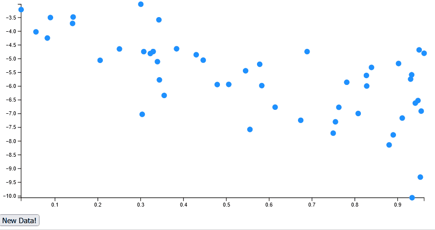

## Simple D3.js app
This is a minimum example of a web application using FastAPI as a backend and D3.js for the frontend visuals. This example includes the following features:
- Setting margins and chart size
- Build axes and scale them
- General update pattern for a scatter chart
- Event handler to visualize new data

## How to use
1. Clone the repo: `git clone https://github.com/pstuerner/simple-d3-app.git`
2. Install the required packages: `pip install -r requirements.txt`
3. Run the api in a terminal: `cd api/;uvicorn app.main:app --reload --port 8081`
4. Run the frontend in a terminal: `cd frontend/;uvicorn app.main:app --reload`
5. Go to [localhost:8000](http://localhost:8000/)

## Result
The final result looks like this:
